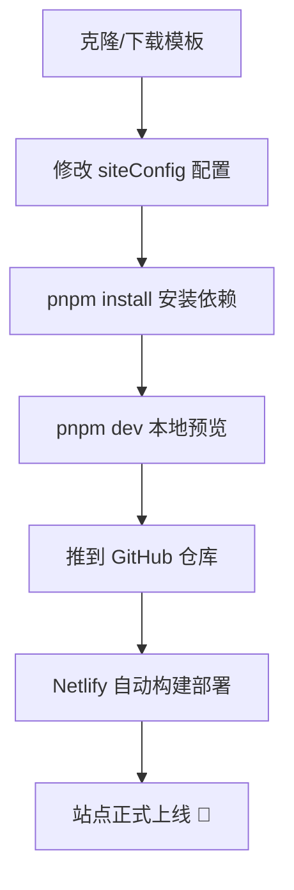

## 写在前面

折腾了好几天，我的博客终于在 2026-08-24 正式上线啦 🎉。

其实「搭个个人博客」这个想法在我心里存了很久：想找个地方放技术笔记、学习心得和生活碎片，不想依赖第三方平台，最好还能完全自己掌控。趁着这个周末，我下定决心把它落地，最后选择了 **Firefly** 这套博客主题模板。这篇就记录一下我的「初体验」：为什么选它、怎么部署的、配置起来感受如何，以及它让我惊喜和吐槽的地方。

## 为什么是 Firefly

先说说我的需求，其实很朴素：

- **快**：静态站点，加载要快，对搜索引擎友好
- **好看**：颜值是第一生产力，界面至少要赏心悦目
- **可定制**：配色、布局、侧边栏都能按自己喜好调
- **好维护**：写文章要简单，最好一个 Markdown 搞定

我前后对比过 Hugo、Hexo、VitePress 这几个主流方案，也都短暂上手过，但总觉得差点意思——要么主题丑，要么功能太少，要么模板代码看得人头疼。直到看到 Firefly，它几乎长在我的需求上：

Firefly 是一款基于 **Astro 7** 构建、用 **Svelte 5** 写交互组件、**Tailwind CSS 4** 做样式、**TypeScript** 全配置的开源博客模板，本质上是 [Fuwari](https://github.com/saicaca/fuwari) 的强化分支。相比原版，它补了一大堆开箱即用的功能：Mermaid/KaTeX/PlantUML 图表公式、GitHub 仓库卡片、图片画廊网格、剧透、提醒框（Admonitions）、全文搜索、加密文章、全屏壁纸、看板娘……而且**配置全部靠改 TypeScript 文件，不用碰模板源码**。这一点对我这种「能用就行、不想深挖代码」的人实在是太友好了。

::github{repo="CuteLeaf/Firefly"}

## 部署过程

流程比我想象中顺畅得多：

1. **初始化**：把模板拉到本地，改掉仓库信息；
2. **本地跑起来**：`pnpm install` 装依赖，`pnpm dev` 启动开发服务器——速度非常快，改配置、改文章都是秒级热更新；
3. **配置站点**：编辑 `src/config/siteConfig.ts`，把站点标题改成了「柒屹のBlog.」，副标题、站点描述、语言（`zh_CN`）、时区（`Asia/Shanghai`）、主题色（青色系，`hue: 200`）一次性配好；
4. **部署上线**：推送到 GitHub 后由 Netlify 自动构建发布，静态站点就活了。整个「写代码 → 部署」的链路几乎没有手动操作。

> [!TIP] 小技巧
> 配置里的注释写得非常详细，几乎每个字段都有中文说明和示例，照着注释改基本不会出错。建议第一次上手时把 `siteConfig.ts` 从头到尾读一遍，比看文档还高效。

## 配置体验

这是我最喜欢 Firefly 的一点：**一切皆配置**。

- `siteConfig.ts`：站点信息、主题色、页面宽度、文章列表布局（列表 / 网格 / 瀑布流）、分页……
- `sidebarConfig.ts`：侧边栏位置（左 / 右 / 双侧）和各组件（搜索、标签、目录、友链等）的排序；
- **页面开关**：友链、留言板、动态、相册、书签导航、打赏页面……每个都是一个布尔值，开即显示、关即隐藏，还自动联动导航栏；
- 分类导航栏、标签样式（胶囊 / 矩形）等细节也都可配。

所有配置都是强类型 TypeScript，编辑时有补全和类型检查，改完保存即生效，不用重启、不用改模板。对非前端深挖型的博主来说，这个「配置驱动」的设计真的省心。

## 让我惊喜的功能

除了部署和配置顺滑之外，Firefly 的内容增强功能也给了我不少惊喜：

- **Pagefind 全文搜索**：纯静态方案，不需要后端服务；
- **Markdown 扩展全家桶**：Mermaid 图表、KaTeX 公式、PlantUML、GitHub 仓库卡片、图片画廊网格、剧透、提醒框……下面两个就是我在这篇文章里用到的：

> [!IMPORTANT] 关于构建
> Firefly 的正式构建（`pnpm build`）包含 LQIP 生成、字体子集化、Pagefind 索引等多个步骤，比普通 Astro 站点略长。本地调试用 `pnpm dev` 完全没问题，只有发布构建会稍慢一些，这是追求极致首屏性能的代价。

还有一句悄悄话：内容 :spoiler[反正我已经用上了，嘿嘿]。

- **加密 / 密码文章**：`password` 字段可以给单篇文章加锁，适合写一些不想公开的内容；
- **沉浸式全屏壁纸**：首页支持全屏背景 + 标题淡出模糊效果，很有氛围感；
- **Swup 页面切换动画**：点击链接有类似 SPA 的过渡效果，但内核仍是纯静态页面，兼顾了体验和性能；
- **多语言 i18n**：内置中 / 英 / 日 / 韩 / 俄等多语言，想国际化也很方便。

## 一些遗憾

体验整体很好，但也有几点想说：

- **评论系统未默认启用**：`commentConfig.ts` 默认是 `none`，需要自己选 Twikoo / Waline / giscus 之一并配置后端（有的还要自己部署）。我目前还没接，等后面有空再补上；
- **文档有点分散**：`docs/` 和 `Firefly-Docs/` 里各有一套说明，一些进阶功能（比如看板娘、追番页）找起来需要花点时间翻；
- **部分功能默认关闭**：像 VNDB、Bangumi、Bilibili 追番这些页面开关都是 `false`，要自己去 `siteConfig.ts` 里逐个打开；
- **构建时间偏长**：上面提过，完整 build 要好几分钟，改图片后还要重新生成 LQIP 数据。

## 总结

- **上手难度**：★★☆☆☆（很低，配置驱动）
- **颜值与自定义**：★★★★★
- **功能丰富度**：★★★★★
- **构建与部署体验**：★★★★☆

总的来看，Firefly 是一套「开箱可用、上限很高」的博客模板：对新手友好，对折腾党也留足了扩展空间。如果你想搭一个好看、快速、完全可控的个人博客，非常推荐去 [在线 Demo](https://firefly.cuteleaf.cn/) 和[使用文档](https://docs-firefly.cuteleaf.cn/) 看看。

接下来我打算：把评论系统配上、陆续写一些技术文章和随笔，再把友链和留言板用起来。这篇「初体验」就算是我博客的第一篇正式更新了，希望它能一直写下去 ✨
